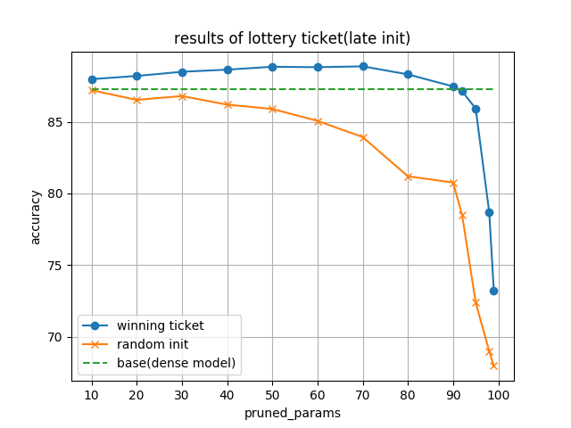

# Re-Implementation of The Lottery Ticket Hypothesis at Scale
This repository is the re-Implementation of the LT at Scale.
Using late initialization to prune the cnn model

## Experimental Setup(in this repo)
1. dataset is cifar10
2. total 30epochs
3. cnn model is tiny version (please check train.py and modules.py)
4. learning rate=0.1, momentum=0.9, weight_decay=5e-4 using SGD optimizer
5. Standard Data Augmentation is used

For late resetting, train 1 epoch. 

### How to use?(example)
First, train model
***
python3 train.py
***
The results are automatically saved in log_file in csv format

For visualizing plot,
***
python3 plot.py
***
