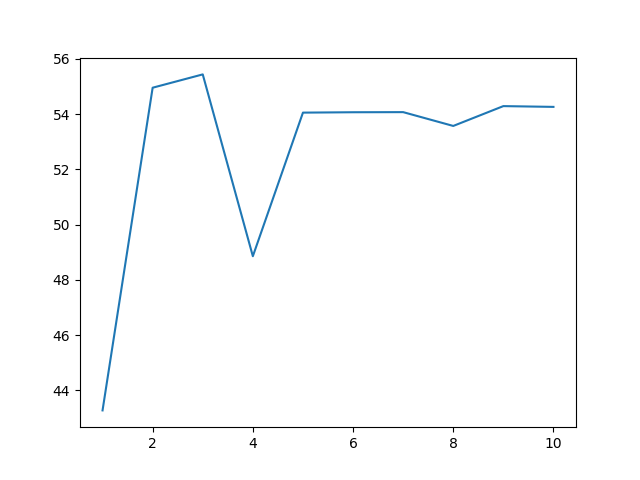

# Re-Implementation of Learning Efficient Convolutional Networks through Network Slimming

## current experimental setup
1. dataset is cifar10
2. CNN is tiny version (please check train.py and modules.py)
3. epochs are 10
4. In a half of epochs, pruning is conducted based on ratio (In default, 0.2).

## results

This result is the above setup.
Pruning is done in epoch 5.

## How to use?
First, train model
***
python3 train.py
***
The train_log.csv is automatically saved.
To visualize accuracy,
***
python3 plot.py
***

In current setting, simply visualize relationships between epochs and accuracy.
If you want to visualize other information (like, total params, loss,...), you need to change source files.
