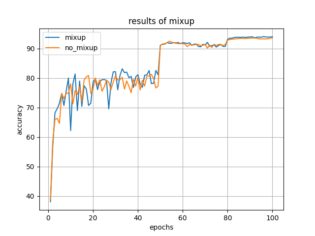

# Re-Implementation of "mixup: BEYOND EMPIRICAL RISK MINIMIZATION"

## experimental setups (vgg16 with batch norm)
- epochs = 100
- batch_size = 100
- optimizer = SGD

## results
|| mixup | normal |
|----|----|----|
|accuracy| 94.02 [%] | 93.52 [%]|

## Usage of example (additional setup is written in configure.py or train.py)
python3 train.py --alpha 0.2
